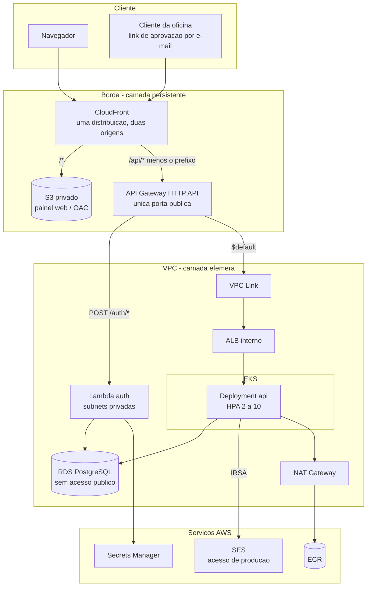
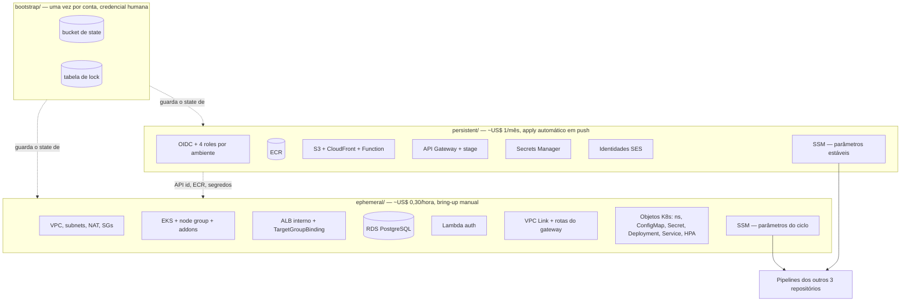

# oficina-mecanica-infrastructure

Provisiona **todos** os recursos do sistema de gestão de oficina mecânica: AWS e
Kubernetes. Os outros três repositórios armazenam código, constroem artefatos e
fazem deploy nos recursos criados aqui.

Este é também o repositório que documenta a **arquitetura do sistema completo** —
os READMEs dos outros três são operacionais e apontam para cá.

## Os quatro repositórios

| Repositório | Responsabilidade | Artefato |
|---|---|---|
| **oficina-mecanica-infrastructure** | Terraform, manifestos Kubernetes, IAM, rede | *(este)* |
| [oficina-mecanica-monolith](https://github.com/SOAT-15-Oficina/oficina-mecanica-monolith) | API de OS, catálogos, usuários; **dono do schema do banco** | imagem no ECR |
| [oficina-mecanica-serverless](https://github.com/SOAT-15-Oficina/oficina-mecanica-serverless) | `POST /auth/login` e `POST /auth/register` | zip da Lambda |
| [oficina-mecanica-frontend](https://github.com/SOAT-15-Oficina/oficina-mecanica-frontend) | Painel web estático | objetos no S3 |

## Documentação da arquitetura

Este repositório é o dono da visão de sistema. A documentação formal — diagramas,
RFCs, ADRs e o modelo de dados — vive em [`docs/`](docs/):

| | |
|---|---|
| [Índice completo](docs/README.md) | como o conjunto se organiza |
| [Componentes](docs/diagramas/componentes.md) | visão de nuvem: borda, VPC, APIs, banco, observabilidade |
| [Sequência — autenticação](docs/diagramas/sequencia-autenticacao.md) | login, emissão do JWT e consumo de rota protegida |
| [Sequência — ordem de serviço](docs/diagramas/sequencia-ordem-de-servico.md) | abertura, orçamento, aprovação e execução |
| [Implantação](docs/diagramas/implantacao.md) | onde cada artefato roda e quem faz o deploy |
| [Modelo de dados](docs/banco-de-dados.md) | justificativa do banco, ER, relacionamentos e ajustes |
| [RFCs](docs/README.md#rfcs--propostas-técnicas) | nuvem, banco, autenticação, observabilidade, repositórios |
| [ADRs](docs/README.md#adrs--decisões-arquiteturais) | 11 decisões em vigor |

O restante deste README é **operacional**: o que este repositório provisiona e
como operá-lo.

## Arquitetura



**EKS, ALB, RDS e o bucket S3 são inalcançáveis de fora.** A única porta pública
é o API Gateway; o bucket só aceita o CloudFront, via Origin Access Control.

### Caminho de uma requisição

```
Navegador → CloudFront ─┬─ /*      → S3 (painel)
                        └─ /api/*  → API Gateway ─┬─ POST /auth/*  → Lambda ──┐
                                                  └─ $default → VPC Link →    │
                                                       ALB interno → pods ────┤
                                                                              └→ RDS
```

Uma **CloudFront Function** remove o prefixo `/api` antes de repassar à origem.
Por isso o monolito continua servindo `/customers` e a Lambda `/auth/login`, sem
saber que existe um `/api` na frente — e o painel, servido da mesma origem, não
precisa de CORS nem de URL de API configurada no build.

## Arquitetura deste repositório

Os diretórios Terraform e o que cada um possui:



O corte é por **ciclo de vida**, não por tipo de recurso — o racional está na
[ADR-0006](docs/adr/0006-duas-camadas-de-terraform.md), e o desvio em relação ao
enunciado da fase (infra de banco e de cluster no mesmo repositório) está
registrado na [RFC-0005](docs/rfc/0005-segregacao-em-repositorios.md).

## Deploy ativo e contratos de API

Este repositório não expõe API própria. Ele **cria** a porta pública e publica a
URL no SSM:

```bash
aws ssm get-parameter --name /oficina-mecanica/prod/public_base_url \
  --query Parameter.Value --output text
# ou, logo após um apply:
terraform -chdir=persistent output public_base_url
```

| | |
|---|---|
| Produção | `/oficina-mecanica/prod/public_base_url` |
| Homologação | `/oficina-mecanica/homolog/public_base_url` |
| Swagger da API de negócio | `<URL_PUBLICA>/api/docs` · [fonte](https://github.com/SOAT-15-Oficina/oficina-mecanica-monolith/blob/main/docs/swagger.yaml) |
| Contrato de `/auth/*` | [fonte](https://github.com/SOAT-15-Oficina/oficina-mecanica-serverless/blob/main/docs/openapi.yaml) |

Com o ambiente desligado, o domínio existe e responde 404 — comportamento
esperado, ver [ADR-0003](docs/adr/0003-api-gateway-como-unica-porta-publica.md).

## Duas camadas de Terraform

O ambiente sobe sob demanda e desce quando não está em uso. Nem tudo suporta
esse ciclo:

| Camada | Diretório | Custo | Conteúdo |
|---|---|---|---|
| **Persistente** | `persistent/` | ~US$ 1/mês | state, OIDC + 4 roles, ECR, identidades SES, S3, CloudFront, **API Gateway**, Secrets Manager |
| **Efêmera** | `ephemeral/` | ~US$ 0,30/hora | VPC, NAT, EKS, ALB interno, RDS, Lambda, VPC Link, rotas do API Gateway, todos os objetos Kubernetes |
| **Bootstrap** | `bootstrap/` | centavos | bucket de state e tabela de lock; aplicado uma vez, à mão |

Três coisas foram para a camada persistente por razões concretas, não por
conveniência:

- **Identidades SES** — destruir uma remove-a da conta, e recriá-la exige que
  alguém clique num link de verificação por e-mail. Seria um passo manual antes
  de cada bring-up.
- **CloudFront + S3** — criar uma distribuição leva ~15-20 min e destruí-la
  outros ~15-25 (precisa ser desabilitada antes). Parados custam ~US$ 0, e o
  domínio permanece estável — o que importa porque ele é a base dos links de
  aprovação enviados aos clientes por e-mail.
- **API Gateway** — custa US$ 0 parado, e é a *origin* do CloudFront. Se fosse
  recriado a cada ciclo, o domínio `{id}.execute-api...` mudaria e a origin
  ficaria apontando para o vazio. Só as **rotas, integrações e o VPC Link** são
  efêmeros; com o ambiente desligado o API existe e responde 404.

## Dois ambientes

**Homologação** e **produção** são a mesma stack aplicada duas vezes, na mesma
conta AWS. O que as separa é o valor de `var.environment`, que prefixa cada nome
de recurso (`oficina-mecanica-homolog-*` × `oficina-mecanica-prod-*`), cada
parâmetro do SSM e cada role.

| | homologação | produção |
|---|---|---|
| Branch | `hml` | `main` |
| GitHub Environment | `homolog` | `production` |
| Prefixo no SSM | `/oficina-mecanica/homolog` | `/oficina-mecanica/prod` |
| State (mesmo bucket) | `homolog/<camada>/terraform.tfstate` | `<camada>/terraform.tfstate` |
| Roles OIDC | `oficina-mecanica-homolog-gha-*` | `oficina-mecanica-prod-gha-*` |
| Identidades SES | usa as da conta | **cria** as da conta |

**A branch é a única fonte da verdade.** Nenhum workflow de aplicação tem input
de ambiente: `ci.yml` deriva tudo de `github.ref_name`. O `bring-up` e o
`tear-down` têm input — são manuais e não têm branch implícita — mas abortam se
ele não bater com o ref de onde foram disparados. E a trust policy do OIDC repete
a mesma regra do lado da AWS: a role de homologação só aceita
`ref:refs/heads/hml` e `environment:homolog`. Um push em `hml` não obtém
credencial de produção nem trocando o ARN do secret.

### Por que a mesma conta

Isolamento por nomeação e IAM, não por fronteira de conta. Duas contas dariam
blast radius e billing separados, mas exigiriam um segundo bootstrap, um segundo
provider OIDC e **reverificar o e-mail no SES da conta nova** — que é justamente
o passo manual que a camada persistente existe para evitar.

O preço dessa escolha é uma colisão real, tratada explicitamente: identidade SES
pertence à conta e é endereçada pelo próprio e-mail, então o segundo ambiente a
criar `fulano@example.com` morreria com `AlreadyExists`. Só produção as possui
(`manage_ses_identities`); homologação envia por elas, o que funciona porque a
policy IRSA da API usa `resources = ["*"]`. Cada ambiente tem o próprio
*configuration set*, então as métricas de envio não se misturam.

### O state de produção não mudou de lugar

A `key` do backend saiu do bloco `backend "s3"` e passou a vir de
`-backend-config=<ambiente>.s3.tfbackend`. Produção manteve o caminho legado
(`persistent/terraform.tfstate`); só os ambientes criados depois ganham prefixo.
Mover o state de produção exigiria `init -migrate-state` numa camada que guarda a
senha do RDS e a chave JWT — risco sem retorno.

Rodando à mão, **o backend e o var-file precisam apontar para o mesmo
ambiente**:

```bash
terraform -chdir=persistent init -backend-config=homolog.s3.tfbackend
terraform -chdir=persistent apply -var-file=../homolog.tfvars
```

Um `init` sem `-backend-config` pergunta a `key`; com `-input=false` (como no CI)
ele falha. Os dois comportamentos são melhores que herdar um state por engano.

## Ciclo de vida

```bash
# uma vez por conta, com credencial humana
cd bootstrap && terraform init && terraform apply
```

Um ambiente **novo** também precisa de um empurrão humano, uma vez. É um
ovo-e-galinha: o `terraform.yml` de `hml` autentica com a role
`oficina-mecanica-homolog-gha-infrastructure`, que só passa a existir depois do
primeiro `apply` da camada persistente de homologação. A role de produção não
serve — a trust policy dela não aceita `environment:homolog`, que é exatamente o
ponto.

```bash
# uma vez por ambiente novo, com credencial humana
terraform -chdir=persistent init -backend-config=homolog.s3.tfbackend
terraform -chdir=persistent apply -var-file=../homolog.tfvars

# o ARN a cadastrar como AWS_DEPLOY_ROLE_ARN no Environment `homolog` de cada repo
terraform -chdir=persistent output github_role_arns
```

Depois, tudo por workflow:

| Workflow | Gatilho | O que faz |
|---|---|---|
| `terraform.yml` | PR → `main` ou `hml` | fmt, validate, tflint nas três camadas |
| `terraform.yml` | push → `hml` | `apply` da **persistente** de homologação |
| `terraform.yml` | push → `main` | `apply` da **persistente** de produção, com required reviewer |
| `bring-up.yml` | manual, input `environment` | apply da efêmera → dispara os 3 deploys → verifica o endpoint público |
| `tear-down.yml` | manual (`environment` + confirmação) | remove TargetGroupBindings → destroy da efêmera → **verifica que nada sobrou** |

`bring-up` e `tear-down` precisam ser disparados da branch do ambiente: `hml`
para homologação, `main` para produção. O código que sobe um ambiente é o código
promovido para ele — o workflow aborta antes de tocar na AWS se o par não bater.

O `bring-up` leva ~25-30 min do zero até demonstrável. **Ensaie uma vez antes de
valer**, e não descubra no dia — e é para isso que homologação existe.

Os dois ambientes sobem e descem de forma independente: a chave de `concurrency`
inclui o nome do ambiente, então mexer em homologação não segura produção na
fila. Subir e derrubar o *mesmo* ambiente continuam serializados.

## Decisões que a estrutura carrega

### O ALB é do Terraform, não de um Ingress

A integração VPC Link do HTTP API aponta para o **ARN de um listener**. Se o ALB
nascesse de um `Ingress`, quem o criaria seria o AWS Load Balancer Controller, de
forma assíncrona — e o ARN não existiria no `plan`, exigindo descoberta por tag
com retry ou um apply em duas fases.

Então o Terraform cria `aws_lb` (internal) + target group (`target_type = ip`) +
listener, e o controller entra apenas pelo CR **`TargetGroupBinding`**, mantendo
o target group populado com os IPs dos pods conforme o HPA escala.

Efeito colateral valioso: como o Terraform é dono do ALB, o `destroy` remove na
ordem certa — e o problema clássico de **ENI órfã travando a deleção da subnet**
(o maior risco de um ambiente efêmero) deixa de existir.

### Terraform é dono da forma; o CD é dono do artefato

O `Deployment` e a `aws_lambda_function` são recursos deste repositório, criados
com **placeholders** (`registry.k8s.io/pause:3.9` e um zip que responde 503) e
com `lifecycle.ignore_changes` nos campos que o CD controla:

| Recurso | Propriedade do Terraform | Propriedade do CD |
|---|---|---|
| `kubernetes_deployment.api` | probes, recursos, `envFrom`, ServiceAccount | tag da imagem, réplicas (HPA) |
| `aws_lambda_function.auth` | VPC, memória, timeout, role, env | zip do código |

Assim um `terraform apply` nunca reverte um release, e um deploy nunca altera
probes ou HPA. `wait_for_rollout = false` no Deployment porque, com o
placeholder, nenhum pod fica *Ready* e o apply esperaria até o timeout.

### NAT Gateway, não VPC endpoints

Um cluster sem saída para a internet não consegue puxar três imagens
obrigatórias, e endpoint de ECR não dá acesso a registry público:

| Imagem | Origem |
|---|---|
| `registry.k8s.io/pause:3.9` | placeholder do Deployment |
| `registry.k8s.io/metrics-server/...` | necessário para o HPA |
| `public.ecr.aws/eks/aws-load-balancer-controller` | quem popula o target group |

Sem NAT, o `bring-up` morre em `ImagePullBackOff` justamente no controller. O
**gateway endpoint do S3** entra porque é gratuito e tira do NAT o maior volume
de tráfego (as camadas de imagem do ECR são servidas pelo S3).

### Contrato entre repositórios via SSM

Os pipelines de aplicação não têm Terraform nem acesso ao bucket de state (que
contém segredos). Leem daqui:

| Parâmetro | Camada | Consumidor |
|---|---|---|
| `ecr_repository_url` | persistente | monolith |
| `eks_cluster_name`, `kube_namespace`, `api_deployment_name` | efêmera | monolith |
| `auth_lambda_name` | persistente | serverless |
| `frontend_bucket_name`, `cloudfront_distribution_id`, `public_domain` | persistente | frontend |
| `jwt_secret_arn`, `database_secret_arn` | persistente | Lambda, cluster |

Prefixo: `/oficina-mecanica/<ambiente>/` — `prod` ou `homolog`. Os pipelines o
montam a partir da branch; nenhum deles carrega o nome de um ambiente fixo.

### Autenticação dos pipelines

**OIDC**, sem access key em lugar nenhum. Uma role por repositório, com o mínimo:

| Role | Pode |
|---|---|
| `gha-monolith` | push no ECR, `eks:DescribeCluster`, editar o namespace `workshop` |
| `gha-serverless` | `lambda:UpdateFunctionCode` numa função específica |
| `gha-frontend` | escrever num bucket específico, invalidar uma distribuição |
| `gha-infrastructure` | admin — é quem cria tudo; o freio é o required reviewer |

São **quatro roles por ambiente** — os nomes acima são o sufixo de
`oficina-mecanica-<ambiente>-`. Cada role confia apenas em workflows do seu
repositório, na branch daquele ambiente (`main` para produção, `hml` para
homologação) ou sob o GitHub Environment correspondente.

`AWS_DEPLOY_ROLE_ARN` é um **secret de GitHub Environment**, não de repositório:
os dois ambientes usam o mesmo nome e só o escopo do Environment os separa. Em
cada um dos 4 repositórios, nos Environments `production` e `homolog`, com os
valores do output `github_role_arns` do ambiente correspondente. `AWS_REGION`
continua sendo uma variable de repositório — a região é a mesma nos dois.

Trocar dois ARNs entre si dá `AccessDenied` ao assumir: a trust policy amarra
cada role ao nome do repositório **e** ao ambiente.

### E-mail

O monolito envia pela **API do SES v2 via IRSA**: o pod assume uma role através
de um ServiceAccount anotado, e não existe credencial estática em lugar nenhum.

`EMAIL_PROVIDER = "ses"` é fixado no ConfigMap em `ephemeral/k8s.tf`, e a mesma
camada é aplicada aos dois ambientes: **homologação e produção enviam pelo SES,
sem exceção**. O `mailhog` existe apenas no `local/docker-compose.local.yml`.

A conta tem **acesso de produção concedido** no SES (`sa-east-1`), com cota de
50.000 e-mails/24h a 14/segundo — a fila de sandbox (200/24h, 1/s, só
destinatários verificados) não se aplica mais. Entrega para qualquer
destinatário; o que continua exigindo verificação é o **remetente**
(`var.ses_sender_email`), e um `MessageRejected` ainda é possível — remetente
não verificado, destinatário em lista de supressão, conta pausada. O provider do
monolito propaga esse erro em vez de engoli-lo.

Verificar um remetente **não é automatizável** — o endereço recebe um link que
alguém precisa clicar. Por isso as identidades vivem na camada persistente.

> **Consequência de sair do sandbox:** homologação também passou a alcançar
> caixas reais. O sandbox era, na prática, uma rede de proteção contra e-mail de
> teste chegando a cliente de verdade; ela não existe mais. Use dados de
> exemplo com endereços controlados em `hml`.

Cada ambiente tem o próprio *configuration set* (`oficina-mecanica-homolog` e
`oficina-mecanica-prod`), então as métricas de envio não se misturam.

### Segredos

`DATABASE_PASSWORD` e `JWT_SECRET_KEY` vêm do Secrets Manager e são
materializados no cluster como `kubernetes_secret` pelo Terraform.

**Consequência assumida:** o valor em claro passa pelo `tfstate`. Por isso o
bucket de state tem versionamento, SSE e uma policy que nega qualquer acesso
fora de TLS — e por isso a role de infraestrutura é a única que o lê.

O JWT secret tem **dois leitores**: a Lambda assina, o monolito valida.

## Desenvolvimento local

```bash
docker compose -f local/docker-compose.local.yml up --build
# http://localhost:8080   painel + API
# http://localhost:8025   MailHog (substitui o SES)
```

Sobe painel + Lambda + monolito + Postgres + MailHog atrás de um **nginx que
replica o roteamento do CloudFront**, inclusive a remoção do prefixo `/api`.
Local e produção têm as mesmas URLs, e o front não precisa de configuração
condicional.

Assume os quatro repositórios clonados lado a lado. Uma peça extra:
`local/lambda-shim/` converte HTTP em evento `APIGatewayV2HTTPRequest`, porque o
Lambda Runtime Interface Emulator não fala HTTP comum — é o papel que o API
Gateway cumpre em produção.

Para trabalhar em um repositório isolado, cada um tem seu próprio
`docker-compose.yml`.

## Custo

| | |
|---|---|
| Camada persistente, parada | US$ 1/mês por ambiente (Secrets Manager US$ 0,80 + S3/ECR) |
| Camada efêmera, ligada | US$ 0,30/hora (EKS US$ 0,10 + 2× t3.medium + NAT + ALB + RDS) |

Uma janela de uso de 4 horas custa cerca de **US$ 1,20**.

Homologação é efêmera pelo mesmo motivo que produção: mantê-la de pé 24/7
custaria ~US$ 200/mês, mais que o ambiente que ela existe para proteger. Em
repouso, os dois ambientes juntos custam ~US$ 2/mês — o dobro de um, não o dobro
do sistema.
