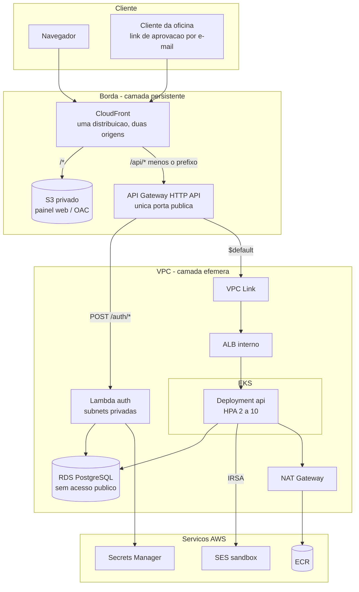

# oficina-mecanica-infrastructure

Provisiona **todos** os recursos do sistema de gestão de oficina mecânica: AWS e
Kubernetes. Os outros três repositórios armazenam código, constroem artefatos e
fazem deploy nos recursos criados aqui.

Este é também o repositório que documenta a **arquitetura do sistema completo** —
os READMEs dos outros três são operacionais e apontam para cá.

## Os quatro repositórios

| Repositório | Responsabilidade | Artefato |
|---|---|---|
| **oficina-mecanica-infrastructure** | Terraform, manifestos Kubernetes, IAM, rede | *(este)* |
| [oficina-mecanica-monolith](https://github.com/SOAT-15-Oficina/oficina-mecanica-monolith) | API de OS, catálogos, usuários; **dono do schema do banco** | imagem no ECR |
| [oficina-mecanica-serverless](https://github.com/SOAT-15-Oficina/oficina-mecanica-serverless) | `POST /auth/login` e `POST /auth/register` | zip da Lambda |
| [oficina-mecanica-frontend](https://github.com/SOAT-15-Oficina/oficina-mecanica-frontend) | Painel web estático | objetos no S3 |

## Arquitetura



**EKS, ALB, RDS e o bucket S3 são inalcançáveis de fora.** A única porta pública
é o API Gateway; o bucket só aceita o CloudFront, via Origin Access Control.

### Caminho de uma requisição

```
Navegador → CloudFront ─┬─ /*      → S3 (painel)
                        └─ /api/*  → API Gateway ─┬─ POST /auth/*  → Lambda ──┐
                                                  └─ $default → VPC Link →    │
                                                       ALB interno → pods ────┤
                                                                              └→ RDS
```

Uma **CloudFront Function** remove o prefixo `/api` antes de repassar à origem.
Por isso o monolito continua servindo `/customers` e a Lambda `/auth/login`, sem
saber que existe um `/api` na frente — e o painel, servido da mesma origem, não
precisa de CORS nem de URL de API configurada no build.

## Duas camadas de Terraform

O ambiente sobe para apresentações e desce depois. Nem tudo suporta esse ciclo:

| Camada | Diretório | Custo | Conteúdo |
|---|---|---|---|
| **Persistente** | `persistent/` | ~US$ 1/mês | state, OIDC + 4 roles, ECR, identidades SES, S3, CloudFront, **API Gateway**, Secrets Manager |
| **Efêmera** | `ephemeral/` | ~US$ 0,30/hora | VPC, NAT, EKS, ALB interno, RDS, Lambda, VPC Link, rotas do API Gateway, todos os objetos Kubernetes |
| **Bootstrap** | `bootstrap/` | centavos | bucket de state e tabela de lock; aplicado uma vez, à mão |

Três coisas foram para a camada persistente por razões concretas, não por
conveniência:

- **Identidades SES** — destruir uma remove-a da conta, e recriá-la exige que
  alguém clique num link de verificação por e-mail. Seria um passo manual antes
  de cada apresentação.
- **CloudFront + S3** — criar uma distribuição leva ~15-20 min e destruí-la
  outros ~15-25 (precisa ser desabilitada antes). Parados custam ~US$ 0, e o
  domínio permanece estável — o que importa porque ele é a base dos links de
  aprovação enviados aos clientes por e-mail.
- **API Gateway** — custa US$ 0 parado, e é a *origin* do CloudFront. Se fosse
  recriado a cada ciclo, o domínio `{id}.execute-api...` mudaria e a origin
  ficaria apontando para o vazio. Só as **rotas, integrações e o VPC Link** são
  efêmeros; com o ambiente desligado o API existe e responde 404.

## Ciclo de vida

```bash
# uma vez, com credencial humana
cd bootstrap && terraform init && terraform apply
```

Depois, tudo por workflow:

| Workflow | Gatilho | O que faz |
|---|---|---|
| `terraform.yml` | PR → `main` | fmt, validate, tflint nas três camadas; `plan` comentado no PR |
| `terraform.yml` | push → `main` | `apply` da camada **persistente**, com required reviewer |
| `bring-up.yml` | manual | apply da efêmera → dispara os 3 deploys → verifica o endpoint público |
| `tear-down.yml` | manual (confirmação) | remove TargetGroupBindings → destroy da efêmera → **verifica que nada sobrou** |

O `bring-up` leva ~25-30 min do zero até demonstrável. **Ensaie uma vez antes de
valer**, e não descubra no dia.

## Decisões que a estrutura carrega

### O ALB é do Terraform, não de um Ingress

A integração VPC Link do HTTP API aponta para o **ARN de um listener**. Se o ALB
nascesse de um `Ingress`, quem o criaria seria o AWS Load Balancer Controller, de
forma assíncrona — e o ARN não existiria no `plan`, exigindo descoberta por tag
com retry ou um apply em duas fases.

Então o Terraform cria `aws_lb` (internal) + target group (`target_type = ip`) +
listener, e o controller entra apenas pelo CR **`TargetGroupBinding`**, mantendo
o target group populado com os IPs dos pods conforme o HPA escala.

Efeito colateral valioso: como o Terraform é dono do ALB, o `destroy` remove na
ordem certa — e o problema clássico de **ENI órfã travando a deleção da subnet**
(o maior risco de um ambiente efêmero) deixa de existir.

### Terraform é dono da forma; o CD é dono do artefato

O `Deployment` e a `aws_lambda_function` são recursos deste repositório, criados
com **placeholders** (`registry.k8s.io/pause:3.9` e um zip que responde 503) e
com `lifecycle.ignore_changes` nos campos que o CD controla:

| Recurso | Propriedade do Terraform | Propriedade do CD |
|---|---|---|
| `kubernetes_deployment.api` | probes, recursos, `envFrom`, ServiceAccount | tag da imagem, réplicas (HPA) |
| `aws_lambda_function.auth` | VPC, memória, timeout, role, env | zip do código |

Assim um `terraform apply` nunca reverte um release, e um deploy nunca altera
probes ou HPA. `wait_for_rollout = false` no Deployment porque, com o
placeholder, nenhum pod fica *Ready* e o apply esperaria até o timeout.

### NAT Gateway, não VPC endpoints

Um cluster sem saída para a internet não consegue puxar três imagens
obrigatórias, e endpoint de ECR não dá acesso a registry público:

| Imagem | Origem |
|---|---|
| `registry.k8s.io/pause:3.9` | placeholder do Deployment |
| `registry.k8s.io/metrics-server/...` | necessário para o HPA |
| `public.ecr.aws/eks/aws-load-balancer-controller` | quem popula o target group |

Sem NAT, o `bring-up` morre em `ImagePullBackOff` justamente no controller. O
**gateway endpoint do S3** entra porque é gratuito e tira do NAT o maior volume
de tráfego (as camadas de imagem do ECR são servidas pelo S3).

### Contrato entre repositórios via SSM

Os pipelines de aplicação não têm Terraform nem acesso ao bucket de state (que
contém segredos). Leem daqui:

| Parâmetro | Camada | Consumidor |
|---|---|---|
| `ecr_repository_url` | persistente | monolith |
| `eks_cluster_name`, `kube_namespace`, `api_deployment_name` | efêmera | monolith |
| `auth_lambda_name` | persistente | serverless |
| `frontend_bucket_name`, `cloudfront_distribution_id`, `public_domain` | persistente | frontend |
| `jwt_secret_arn`, `database_secret_arn` | persistente | Lambda, cluster |

Prefixo: `/oficina-mecanica/prod/`.

### Autenticação dos pipelines

**OIDC**, sem access key em lugar nenhum. Uma role por repositório, com o mínimo:

| Role | Pode |
|---|---|
| `gha-monolith` | push no ECR, `eks:DescribeCluster`, editar o namespace `workshop` |
| `gha-serverless` | `lambda:UpdateFunctionCode` numa função específica |
| `gha-frontend` | escrever num bucket específico, invalidar uma distribuição |
| `gha-infrastructure` | admin — é quem cria tudo; o freio é o required reviewer |

Cada role confia apenas em workflows do seu repositório, na branch `main`.

Configure `AWS_DEPLOY_ROLE_ARN` (secret) e `AWS_REGION` (variable) em cada
repositório com os valores do output `github_role_arns`.

### E-mail

O monolito envia pela **API do SES v2 via IRSA**: o pod assume uma role através
de um ServiceAccount anotado, e não existe credencial estática em lugar nenhum.

O SES opera em **sandbox**: entrega apenas para endereços verificados
(`var.ses_verified_emails`), com teto de 200 e-mails/24h e 1/segundo. Endereço
fora da lista recebe `MessageRejected`, e o provider propaga esse erro em vez de
engoli-lo.

Verificar um endereço **não é automatizável** — cada um recebe um link que
alguém precisa clicar. Por isso as identidades vivem na camada persistente.

### Segredos

`DATABASE_PASSWORD` e `JWT_SECRET_KEY` vêm do Secrets Manager e são
materializados no cluster como `kubernetes_secret` pelo Terraform.

**Consequência assumida:** o valor em claro passa pelo `tfstate`. Por isso o
bucket de state tem versionamento, SSE e uma policy que nega qualquer acesso
fora de TLS — e por isso a role de infraestrutura é a única que o lê.

O JWT secret tem **dois leitores**: a Lambda assina, o monolito valida.

## Desenvolvimento local

```bash
docker compose -f local/docker-compose.local.yml up --build
# http://localhost:8080   painel + API
# http://localhost:8025   MailHog (substitui o SES)
```

Sobe painel + Lambda + monolito + Postgres + MailHog atrás de um **nginx que
replica o roteamento do CloudFront**, inclusive a remoção do prefixo `/api`.
Local e produção têm as mesmas URLs, e o front não precisa de configuração
condicional.

Assume os quatro repositórios clonados lado a lado. Uma peça extra:
`local/lambda-shim/` converte HTTP em evento `APIGatewayV2HTTPRequest`, porque o
Lambda Runtime Interface Emulator não fala HTTP comum — é o papel que o API
Gateway cumpre em produção.

Para trabalhar em um repositório isolado, cada um tem seu próprio
`docker-compose.yml`.

## Custo

| | |
|---|---|
| Camada persistente, parada | **~US$ 1/mês** (Secrets Manager US$ 0,80 + S3/ECR) |
| Camada efêmera, ligada | **~US$ 0,30/hora** (EKS US$ 0,10 + 2× t3.medium + NAT + ALB + RDS) |

Uma apresentação de 4 horas custa cerca de **US$ 1,20**.

## Riscos conhecidos

- **`POST /auth/register` é público e aceita `role`** — qualquer um pode criar um
  usuário `admin`. Comportamento herdado do monolito, mantido de forma
  deliberada para que o split fosse estritamente estrutural, e agora exposto numa
  URL pública. Documentado em `oficina-mecanica-serverless`.
- **Segredos no `tfstate`** — mitigado pelo bucket privado, versionado e
  cifrado, mas continua sendo o modelo.
- **RDS é efêmero** — os dados são recriados por migrations + seed a cada
  `bring-up`. Se o seed falhar, falha na frente da plateia.
- **Um NAT só, sem redundância** — perda de disponibilidade, não de
  funcionalidade; aceitável num ambiente de apresentação.
- **Sem observabilidade** — adiado por decisão do time.
