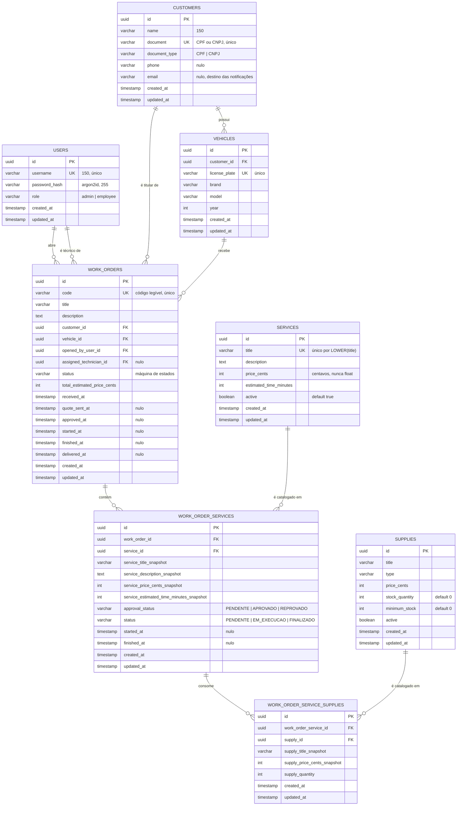

# Modelo de dados

Este documento é o retrato do schema em vigor: por que um relacional gerenciado,
o diagrama entidade-relacionamento, a explicação de cada relacionamento e o
registro dos ajustes feitos no modelo.

A decisão de motor está formalizada na [RFC-0002](./rfc/0002-escolha-do-banco-de-dados.md).

**O schema é propriedade do `oficina-mecanica-monolith`.** As migrations vivem
em `database/migrations/` daquele repositório e são aplicadas por um `Job` do
pipeline ([ADR-0005](./adr/0005-migrations-como-job-do-pipeline.md)). A Lambda de autenticação lê e escreve
`users`, mas nunca roda migration.

## 1. Por que um relacional gerenciado

O domínio é uma ordem de serviço: um agregado com composição fixa
(OS, serviços, insumos), dinheiro, e transições de estado que precisam ser
atômicas. Três propriedades pesaram mais que qualquer outra.

**Integridade referencial declarada no banco.** Um `work_order_service` órfão é
um orçamento errado enviado a um cliente. Com chave estrangeira, o banco
recusa; sem ela, a recusa depende de todo caminho de código lembrar de
verificar. Há onze `FOREIGN KEY` no schema, e todas estão em uso.

**Transação multi-linha.** Aprovar um item recalcula o total da OS, pode
transicionar o status e pode disparar alerta de compra. São escritas em três
tabelas que precisam valer juntas ou não valer. Um banco de documentos
resolveria com um agregado único, mas o catálogo de serviços e o de insumos são
compartilhados entre OSs, e modelá-los embutidos duplicaria dado mutável.

**Consultas analíticas sem pipeline.** Os dashboards exigidos (volume diário de
OS, tempo médio por status, taxa de erro) são `GROUP BY` sobre colunas de
timestamp que já existem. Em SQL são uma query; fora dele, seriam um processo
de agregação a manter.

Escolhido **PostgreSQL 17** em **RDS**. O gerenciamento (backup, patch,
failover, métricas) não é diferencial de uma oficina, e o requisito do desafio
pede banco gerenciado. A comparação com MySQL, Aurora Serverless v2 e DynamoDB
está na [RFC-0002](./rfc/0002-escolha-do-banco-de-dados.md).

### Configuração em vigor

| Item | Valor | Razão |
|---|---|---|
| Engine | PostgreSQL 17 | tipos ricos, índice sobre expressão, `DEFERRABLE` |
| Classe | `var.database_instance_class` | dimensionada por ambiente |
| Storage | gp3, 20 GB com autoscaling até 50 GB | evita `storage-full` sem pagar por espaço parado |
| Criptografia | em repouso, ativada | dado pessoal de cliente (nome, CPF, e-mail, telefone) |
| Acesso público | desabilitado | só de dentro da VPC. Ver [ADR-0003](./adr/0003-api-gateway-como-unica-porta-publica.md) |
| Multi-AZ | desabilitado | ambiente sob demanda. Ver seção 5, Riscos |
| Retenção de backup | 0 dia | idem |
| Credencial | Secrets Manager | nunca em variável de repositório |

## 2. Diagrama entidade-relacionamento



## 3. Os relacionamentos, um a um

### `customers` 1:N `vehicles`

Um cliente tem zero ou mais veículos; um veículo pertence a exatamente um
cliente. A placa é única globalmente, e não por cliente: placa é identidade
nacional do veículo, e duas linhas com a mesma placa significariam cadastro
duplicado. Há índice em `customer_id` porque "veículos deste cliente" é a
consulta da tela de abertura de OS.

### `customers` 1:N `work_orders` e `vehicles` 1:N `work_orders`

A OS aponta para **os dois**, e não apenas para o veículo. É redundância
deliberada. Sem `customer_id` na OS, descobrir o titular exigiria passar por
`vehicles`, e se o veículo for transferido de dono, o histórico da OS antiga
passaria a apontar para o dono novo. A OS guarda quem era o cliente **naquela**
entrada. A consistência entre as duas FKs é responsabilidade da aplicação, que
valida que o veículo pertence ao cliente na criação.

### `users` 1:N `work_orders`, duas vezes

`opened_by_user_id` é obrigatório: toda OS tem um responsável pela abertura.
`assigned_technician_id` é nulo: a OS pode existir antes de haver mecânico
designado. São duas FKs para a mesma tabela, com significados distintos, e por
isso duas colunas em vez de uma tabela de papéis.

### `work_orders` 1:N `work_order_services`

O centro do modelo. Cada linha é **um item do orçamento**: um serviço do
catálogo aplicado a esta OS, com preço congelado, estado de aprovação próprio e
estado de execução próprio.

Os dois estados são independentes de propósito:

| | `approval_status` | `status` |
|---|---|---|
| Quem muda | o cliente, pelo link do e-mail | o mecânico, pela API autenticada |
| Valores | `PENDENTE`, `APROVADO`, `REPROVADO` | `PENDENTE`, `EM_EXECUCAO`, `FINALIZADO` |
| Efeito na OS | quando todas decididas, promove a OS a `APROVADO` ou `CANCELADA` | alimenta o tempo por serviço |

Colapsar os dois em uma coluna tornaria impossível representar "aprovado pelo
cliente, ainda não iniciado pelo mecânico", que é o estado normal de um item
recém-aprovado.

### `services` 1:N `work_order_services`

A FK para o catálogo existe para rastreabilidade e para relatórios por tipo de
serviço. O que é cobrado, porém, vem dos campos `*_snapshot`. Ver
[ADR-0010](./adr/0010-snapshot-de-precos-na-ordem-de-servico.md).

### `work_order_services` 1:N `work_order_service_supplies`

Insumos são consumidos **por serviço**, e não pela OS: trocar óleo e alinhar
consomem peças diferentes, e o cliente pode aprovar só um dos dois. Há índice
**único** em `(work_order_service_id, supply_id)`, porque o mesmo insumo não
aparece duas vezes no mesmo item. A quantidade vai em `supply_quantity`.

### `supplies` 1:N `work_order_service_supplies`

`stock_quantity` e `minimum_stock` moram no catálogo. Comparar o somatório de
`supply_quantity` dos itens aprovados contra `stock_quantity` é o que dispara o
**alerta de compra** e o acréscimo de dois dias no prazo estimado.

## 4. Ajustes feitos no modelo

### 4.1 Snapshot de preço e tempo nos itens da OS

`work_order_services` e `work_order_service_supplies` copiam título, preço e
tempo estimado do catálogo no momento em que o item entra na OS.

É desnormalização deliberada. A alternativa, ler sempre do catálogo, faria um
orçamento aprovado mudar de valor quando o catálogo fosse reajustado, o que é
inaceitável para um documento que o cliente já aprovou. O snapshot também
permite alterar o catálogo sem versionar nada. Racional completo em
[ADR-0010](./adr/0010-snapshot-de-precos-na-ordem-de-servico.md).

### 4.2 Remoção de `work_order_service_status_history`

*(migration `20260505000002_drop_work_order_service_status_history.sql`)*

A tabela guardava uma linha por mudança de estado de item. Foi removida por
três motivos:

- **Não era lida.** Nenhuma consulta do sistema a usava; nenhuma tela a exibia.
- **Era redundante.** Os únicos instantes com significado, início e fim, já
  estão em `started_at` e `finished_at` do próprio item, e os da OS em
  `received_at`, `quote_sent_at`, `approved_at`, `started_at`, `finished_at` e
  `delivered_at`.
- **Custava escrita no caminho quente.** Cada transição gerava um `INSERT`
  adicional dentro da mesma transação.

A métrica de **tempo médio por status** exigida no dashboard sai das colunas de
timestamp, sem a tabela. Para auditar *quem* mudou o quê, o caminho é log
estruturado de evento de domínio ([ADR-0011](./adr/0011-logs-estruturados-com-correlacao.md)). A migration tem
`Down` completo, então a decisão é reversível.

### 4.3 Unicidade de título de serviço, sem sensibilidade a caixa

*(migration `20260422000000_add_services_title_unique_index.sql`)*

```sql
CREATE UNIQUE INDEX idx_services_title_unique ON services (LOWER(title));
```

"Troca de óleo" e "TROCA DE ÓLEO" eram duas linhas do catálogo, com preços que
divergiam com o tempo. Um `UNIQUE` comum não resolve o caso, porque as duas
strings são diferentes, e por isso o índice é sobre expressão. Acompanham dois
índices de leitura: `active`, porque a listagem padrão filtra por serviço
ativo, e `title`, para busca.

### 4.4 Dinheiro em centavos, como inteiro

Toda coluna monetária é `int` com sufixo `_cents`. Nenhum `float` participa de
cálculo de valor. A formatação para reais acontece na borda, ao montar o e-mail
ou a resposta JSON.

### 4.5 Chaves primárias UUID

Geradas pela aplicação, e não pelo banco. Dois motivos:

1. Os links de aprovação enviados por e-mail carregam o UUID do item. Um
   inteiro sequencial ali seria enumerável, e qualquer cliente poderia aprovar
   a OS de outro trocando o número na URL.
2. A aplicação conhece o id antes do `INSERT`, o que simplifica a montagem de
   agregados.

Para o humano, `work_orders.code` é o identificador legível (`UNIQUE`, com
índice). É ele que aparece na consulta pública de status.

### 4.6 Estratégia de índices

Além das chaves primárias e das restrições de unicidade:

| Tabela | Índice | Consulta que atende |
|---|---|---|
| `vehicles` | `customer_id`, `license_plate` | veículos do cliente; busca por placa |
| `work_orders` | `code`, `customer_id`, `vehicle_id`, `status` | consulta pública; histórico; painel filtrado por status |
| `work_order_services` | `work_order_id`, `service_id`, `approval_status`, `status` | montagem do agregado; pendências de aprovação; fila de execução |
| `work_order_service_supplies` | `work_order_service_id`, `supply_id`, único em `(wos_id, supply_id)` | insumos do item; cálculo de falta de estoque |
| `services` | `LOWER(title)` único, `active`, `title` | catálogo |

### 4.7 Foreign keys `DEFERRABLE INITIALLY IMMEDIATE`

Todas as FKs são declaradas assim. O comportamento padrão continua sendo
verificação imediata; a declaração apenas deixa aberta a possibilidade de
adiar a checagem até o `COMMIT` em uma transação específica, o que é útil para
carga em lote e para o seed de dados de exemplo, sem afetar o caminho normal.

### 4.8 Migrations idempotentes

O schema usa `CREATE TABLE IF NOT EXISTS`, `CREATE INDEX IF NOT EXISTS` e
blocos `DO ... EXCEPTION WHEN duplicate_object THEN NULL` para constraints.
Aplicar duas vezes não quebra, o que importa porque o `Job` de migration pode
ser reexecutado após uma falha de rede no meio do rollout
([ADR-0005](./adr/0005-migrations-como-job-do-pipeline.md)).

### 4.9 Regra prática para escrever migration nova

Como o `Job` de migration roda **antes** do rollout, durante alguns segundos o
código antigo conversa com o schema novo. Na prática isso significa migrations
aditivas: adicionar coluna, adicionar índice, adicionar tabela. Remover uma
coluna exige dois deploys, o primeiro parando de usá-la e o segundo
removendo-a.

## 5. Riscos conhecidos

| Risco | Situação | Mitigação se for para produção real |
|---|---|---|
| `multi_az = false` | uma falha de AZ derruba o banco | habilitar Multi-AZ |
| `backup_retention_period = 0` | sem point-in-time recovery | 7 dias ou mais, e snapshot final no destroy |
| Sem particionamento em `work_orders` | irrelevante no volume atual | particionar por `received_at` quando passar de milhões de linhas |
| `max_connections` como teto | HPA até 10 pods, mais o pool por container da Lambda | RDS Proxy antes de aumentar réplicas |

## 6. Como inspecionar

```bash
# local: sobe Postgres e aplica as migrations
cd oficina-mecanica-monolith
docker compose up -d
go run ./cmd/api migrate
```

```bash
# na nuvem: o RDS não é alcançável de fora, use um pod da própria VPC
kubectl -n "$KUBE_NAMESPACE" exec -it deploy/api -- sh
```

O endpoint do banco é publicado no SSM como
`/oficina-mecanica/<ambiente>/database_endpoint`, e a credencial fica no
Secrets Manager.
