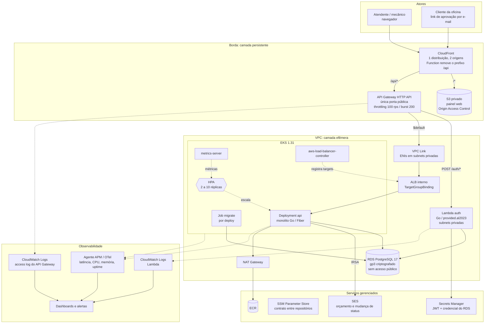

# Diagrama de componentes

Visão de nuvem completa: borda, rede privada, aplicações, banco, serviços
gerenciados e observabilidade. Os quatro repositórios aparecem como donos dos
artefatos que produzem.

Como ler o diagrama: setas cheias são caminho de requisição ou de dado; setas
pontilhadas são relações de controle e de telemetria. Os dois retângulos
maiores separam o que é persistente do que é efêmero
([ADR-0006](../adr/0006-duas-camadas-de-terraform.md)).

## Quem é dono de quê

Esta tabela é a consulta mais frequente de quem chega: dado um componente,
qual repositório alterar.

| Componente | Repositório dono | Artefato |
|---|---|---|
| CloudFront, S3, API Gateway, ECR, Secrets Manager, SSM, SES, IAM/OIDC | `oficina-mecanica-infrastructure` (`persistent/`) | recursos AWS |
| VPC, NAT, EKS, ALB, RDS, Lambda (a função), VPC Link, rotas do API Gateway, todos os objetos Kubernetes | `oficina-mecanica-infrastructure` (`ephemeral/`) | recursos AWS e Kubernetes |
| Imagem do monolito, schema do banco, contrato OpenAPI da API de negócio | `oficina-mecanica-monolith` | imagem no ECR |
| Código da Lambda de autenticação, contrato OpenAPI de `/auth/*` | `oficina-mecanica-serverless` | zip publicado na função |
| Painel web estático | `oficina-mecanica-frontend` | objetos no S3 |

A separação entre **forma** e **conteúdo** é deliberada. O Terraform cria o
`Deployment` e a `aws_lambda_function`, mas ignora a tag da imagem e o
`filename` do zip por meio de `lifecycle.ignore_changes`. Quem publica o
artefato é o pipeline do repositório de código. Sem essa divisão, um
`terraform apply` devolveria a aplicação a uma versão anterior. O mecanismo
completo está na [ADR-0007](../adr/0007-contrato-entre-repositorios-via-ssm.md).

## Superfície pública

Exatamente um endereço é alcançável da internet: o domínio do CloudFront.

- O bucket S3 só aceita requisições assinadas pelo Origin Access Control.
- O API Gateway aceita qualquer origem, mas só expõe `/auth/*` e o `$default`.
- ALB, EKS, RDS e Lambda vivem em subnets privadas. Não têm IP público e não são
  alcançáveis fora da VPC. O VPC Link é a única ponte, e o tráfego nele é
  unidirecional: o gateway alcança o ALB, e nada de fora alcança o gateway por
  esse caminho.

A consequência operacional aparece no dia a dia: não existe `curl` direto no
pod. O pipeline usa `kubectl port-forward` para o smoke check, e a inspeção do
banco é feita de dentro de um pod da própria VPC. O racional completo está na
[ADR-0003](../adr/0003-api-gateway-como-unica-porta-publica.md).

## Onde cada tráfego sai da VPC

| Origem | Destino | Caminho |
|---|---|---|
| Pod da API | RDS | rede privada, security group a security group |
| Pod da API | SES | NAT Gateway, com permissão por IRSA |
| Pod da API | ECR (pull de imagem) | NAT Gateway |
| Lambda auth | RDS e Secrets Manager | rede privada, a Lambda está anexada às subnets privadas |
| Agente de observabilidade | backend SaaS | NAT Gateway |

O NAT Gateway é o único caminho de saída, e é o segundo item mais caro da
camada efêmera depois do control plane do EKS ([RFC-0001](../rfc/0001-escolha-da-nuvem.md)).
