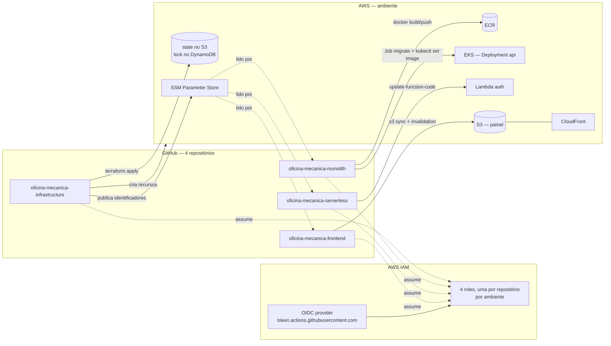
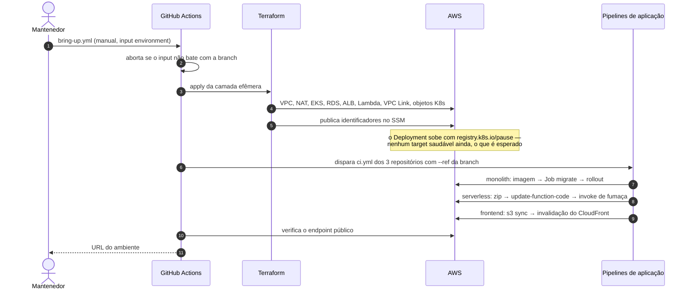

# Diagrama de implantação

Onde cada artefato roda, quem o publica e por qual caminho.

## Branch → ambiente

Nenhum workflow de aplicação aceita input de ambiente. O `ref` já carrega a
informação, e um input separado poderia contradizê-lo.

| Branch | GitHub Environment | Prefixo no SSM | Roles |
|---|---|---|---|
| `hml` | `homolog` | `/oficina-mecanica/homolog` | `oficina-mecanica-homolog-gha-*` |
| `main` | `production` | `/oficina-mecanica/prod` | `oficina-mecanica-prod-gha-*` |

A regra é repetida do lado da AWS: a trust policy da role de homologação só
aceita `ref:refs/heads/hml` e `environment:homolog`. Um push em `hml` não obtém
credencial de produção nem trocando o ARN do secret.

## Ordem de um ciclo completo

O `tear-down.yml` faz o inverso e **verifica que nada sobrou**: remove os
`TargetGroupBinding` antes do destroy (senão o controller recria targets em um
ALB que o Terraform está removendo) e falha se algum recurso da camada efêmera
persistir.

A camada persistente não participa desse ciclo — ver
[ADR-0006](../adr/0006-duas-camadas-de-terraform.md).
