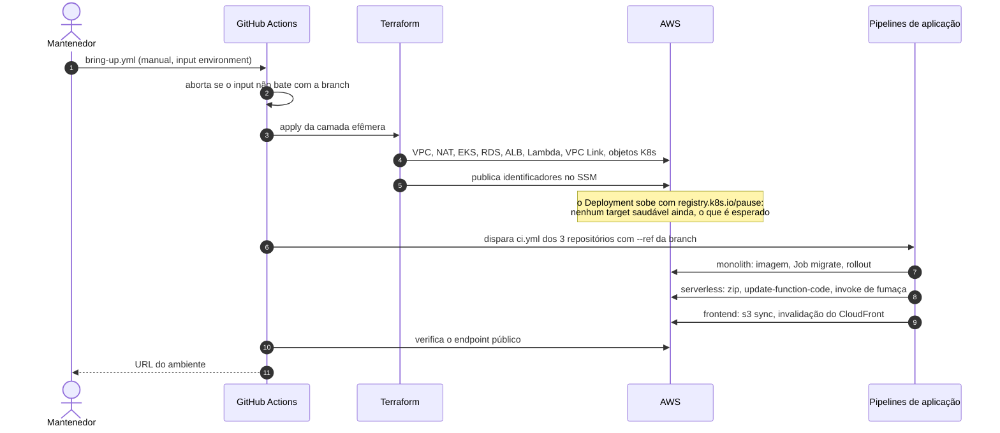

# Implantação e ciclo do ambiente

Onde cada artefato roda, quem o publica e por qual caminho. O diagrama a seguir
liga os quatro repositórios às roles IAM que eles assumem por OIDC e aos
recursos que cada um altera. As setas pontilhadas são leitura do contrato no
SSM e a relação de confiança do IAM.

## As duas camadas de Terraform

| Camada | Diretório | Custo | Conteúdo | Aplicação |
|---|---|---|---|---|
| Bootstrap | `bootstrap/` | centavos | bucket de state, tabela de lock | à mão, uma vez por conta |
| Persistente | `persistent/` | ~US$ 1/mês | OIDC e roles, ECR, identidades SES, S3, CloudFront, API Gateway e stage, Secrets Manager, parâmetros SSM estáveis | automática, em push para `hml` ou `main` |
| Efêmera | `ephemeral/` | ~US$ 0,30/h | VPC, NAT, EKS, ALB interno, RDS, Lambda, VPC Link, rotas e integrações do gateway, objetos Kubernetes | manual, por `bring-up.yml` e `tear-down.yml` |

O corte mais fino está no API Gateway: **o API e o stage são persistentes; as
rotas, as integrações e o VPC Link são efêmeros**. Com o ambiente desligado, o
domínio existe e responde 404, que é o comportamento esperado
([ADR-0006](../adr/0006-duas-camadas-de-terraform.md)).

## Branch decide ambiente

| Branch | GitHub Environment | Prefixo no SSM | Roles |
|---|---|---|---|
| `hml` | `homolog` | `/oficina-mecanica/homolog` | `oficina-mecanica-homolog-gha-*` |
| `main` | `production` | `/oficina-mecanica/prod` | `oficina-mecanica-prod-gha-*` |

Nenhum workflow de aplicação aceita input de ambiente: o `ref` já carrega a
informação. A regra é repetida do lado da AWS, e a trust policy da role de
homologação só aceita `ref:refs/heads/hml` e `environment:homolog`
([ADR-0008](../adr/0008-oidc-para-os-pipelines.md)). `bring-up` e `tear-down` têm input porque são manuais,
mas abortam se ele não bater com o ref de onde foram disparados.

## Ordem de um ciclo completo

Dois pontos que confundem na primeira leitura:

- **O Deployment sobe com a imagem `registry.k8s.io/pause`.** O Terraform cria
  a forma do recurso e o pipeline do monolito publica o conteúdo. Entre um e
  outro, o ALB não tem target saudável, e esse é o estado esperado no meio do
  bring-up ([ADR-0007](../adr/0007-contrato-entre-repositorios-via-ssm.md)).
- **O `tear-down.yml` remove os `TargetGroupBinding` antes do `destroy`.** Sem
  isso, o `aws-load-balancer-controller` recria targets em um ALB que o
  Terraform está removendo. Ao final, o workflow verifica que nenhum recurso da
  camada efêmera sobrou.

## O que cada pipeline de aplicação faz

| Repositório | Etapas do deploy |
|---|---|
| `oficina-mecanica-monolith` | lê identificadores do SSM, `docker build/push` no ECR, cria o `Job migrate-<sha>`, espera a conclusão, `kubectl set image`, `rollout status` |
| `oficina-mecanica-serverless` | lê o nome da função no SSM, publica o zip com `update-function-code`, faz um `invoke` de fumaça |
| `oficina-mecanica-frontend` | lê bucket e id da distribuição no SSM, `s3 sync`, invalidação do CloudFront |

Todo job começa obtendo credencial AWS por OIDC, inclusive o do frontend, que
só faz `s3 sync`: é o custo de ler o contrato no SSM ([ADR-0007](../adr/0007-contrato-entre-repositorios-via-ssm.md)).
Se a migration falhar, o pipeline imprime as últimas 200 linhas de log do `Job`
e aborta, e **o rollout não acontece** ([ADR-0005](../adr/0005-migrations-como-job-do-pipeline.md)).

| Tempo ou custo | Valor |
|---|---|
| Do zero até um ambiente demonstrável | 25 a 30 minutos |
| Criar ou destruir a distribuição CloudFront | 15 a 25 minutos, e por isso ela é persistente |
| Ambiente ligado | ~US$ 0,30/hora, dominado pelo control plane do EKS e pelo NAT Gateway |
| Ambiente desligado | ~US$ 1/mês por ambiente |
| Minutos de GitHub Actions | 2.000/mês compartilhados entre os 4 repositórios |
