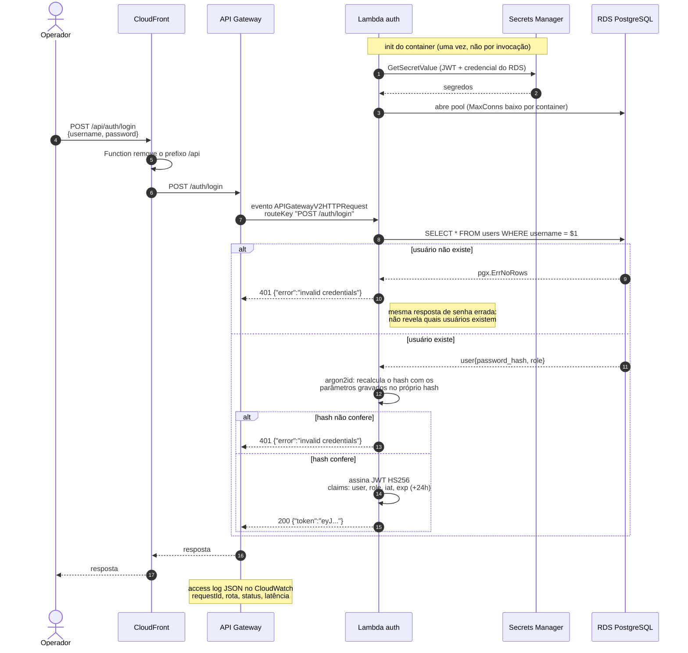
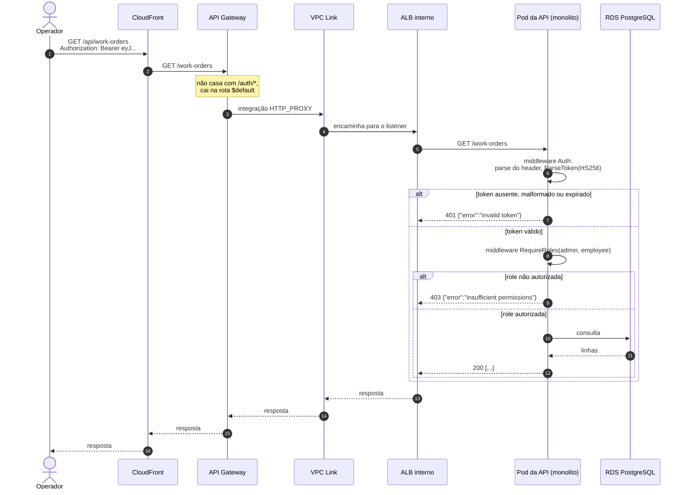

# Autenticação e autorização

Como um operador obtém um token e como esse token é aceito nas rotas
protegidas. São dois fluxos que se encontram no mesmo segredo: a Lambda
**emite** o JWT, o monolito **valida**. Nenhum dos dois chama o outro.

O racional e as alternativas descartadas estão na [RFC-0003](../rfc/0003-estrategia-de-autenticacao.md) e na
[ADR-0009](../adr/0009-jwt-hs256-com-segredo-compartilhado.md), que também fixa a ordem exata da validação e o caminho
do segredo.

## 1. Login e emissão do token

Três detalhes que não aparecem no diagrama:

- **O segredo e o pool são resolvidos no init do container, não por
  invocação.** Um container quente reaproveita os dois, o que evita uma chamada
  ao Secrets Manager e uma abertura de conexão por requisição.
- **`MaxConns` do pool é baixo de propósito.** Cada container quente mantém o
  próprio pool, e o teto real é o `max_connections` do RDS, compartilhado com
  até 10 pods da API ([ADR-0004](../adr/0004-hpa-no-deployment-da-api.md)).
- **Os parâmetros de custo do argon2id vêm do hash gravado**, e não de
  configuração: aumentar o custo passa a valer para senhas novas, sem
  invalidar as antigas.

## 2. Consumo de uma rota protegida

## Papéis e rotas públicas

| Papel | Alcance |
|---|---|
| `admin` | tudo, incluindo `/users` (manutenção de operadores) |
| `employee` | clientes, veículos, catálogos, OS e itens de OS |

`/users` é a única família de rotas restrita a `admin`. Papel ausente ou vazio
no token é tratado como token inválido, e não como ausência de papel.

Estas rotas não exigem `Authorization`:

| Rota | Por que é pública |
|---|---|
| `/ping`, `/ready` | healthcheck, usado pelas probes e pelo monitor externo |
| `/docs/*` | contrato OpenAPI da API |
| `GET /public/work-orders/:code?document=...` | consulta de status pelo cliente final |
| `/public/approvals/*` | aprovação e reprovação de serviços pelo cliente final |

As duas últimas são o canal do cliente final, e a prova de posse é o
identificador não adivinhável (UUID v4 da OS ou do serviço) somado ao documento
do cliente. A discussão de risco desse canal está na
[RFC-0003](../rfc/0003-estrategia-de-autenticacao.md).

**O monolito não conhece a Lambda.** Ele valida assinatura, expiração e a
presença das claims `user` e `role`. Se a Lambda for substituída por outro
emissor que assine com o mesmo segredo, nada muda no monolito. Um teste de
contrato em cada repositório, com token *golden* fixo em
`testdata/token.golden`, garante que os dois lados não divirjam sem que o CI
perceba.
