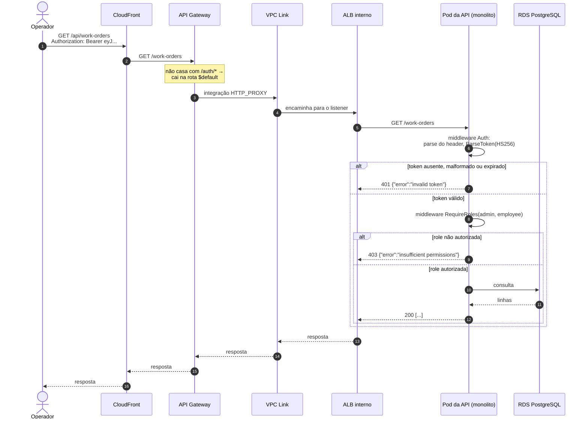

# Diagrama de sequência — autenticação

Como um operador obtém um token e como esse token é aceito nas rotas
protegidas. São dois fluxos que se encontram no mesmo segredo: a Lambda
**emite** o JWT, o monolito **valida**. Nenhum dos dois chama o outro.

## 1. Login e emissão do token

## 2. Consumo de uma rota protegida

## Notas

- **O monolito não conhece a Lambda.** Ele valida assinatura, expiração e a
  presença das claims `user` e `role`. Se a Lambda for substituída por outro
  emissor que assine com o mesmo segredo, nada muda no monolito. Ver
  [ADR-0009](../adr/0009-jwt-hs256-com-segredo-compartilhado.md).
- **Rotas públicas por desenho**, sem `Authorization`: `/ping`, `/ready`,
  `/docs/*`, `GET /public/work-orders/:code?document=...` e
  `/public/approvals/*`. As duas últimas são o canal do cliente final e usam
  identificadores não adivinháveis (UUID da OS ou do serviço) somados ao
  documento do cliente — ver a discussão de risco na
  [RFC-0003](../rfc/0003-estrategia-de-autenticacao.md).
- **O segredo JWT nunca aparece em código nem em variável de repositório.** Vive
  no Secrets Manager; a Lambda lê no init do container, e o pod recebe via
  `Secret` do Kubernetes criado pelo Terraform.
