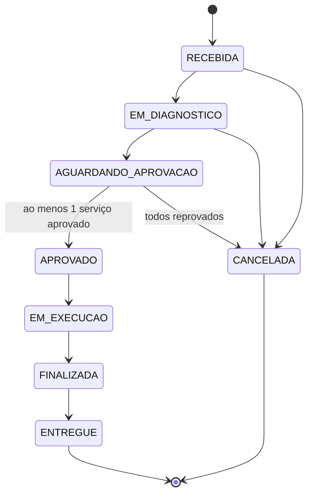
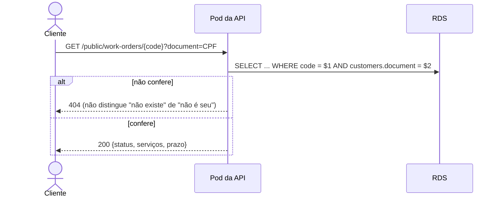
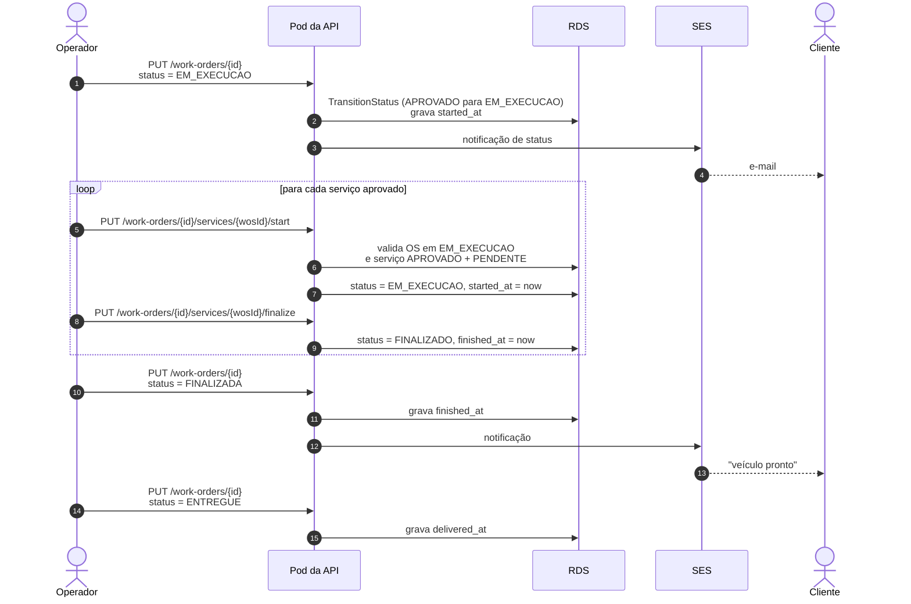

# Ciclo de vida da ordem de serviço

O percurso completo: abertura, diagnóstico, orçamento por e-mail, decisão do
cliente e execução. Dois atores humanos com canais distintos. O operador usa
rotas autenticadas por JWT; o cliente usa links públicos recebidos por e-mail.

## Máquina de estados

A transição é validada no serviço de domínio. Qualquer salto fora deste mapa é
rejeitado com `ErrInvalidStatusTransition`, e o evento
`work_order.transition_rejected` é registrado em log
([ADR-0011](../adr/0011-logs-estruturados-com-correlacao.md)).

Itens só podem ser adicionados ou removidos nos estados `RECEBIDA`,
`EM_DIAGNOSTICO` ou `AGUARDANDO_APROVACAO`. Depois de aprovada, a composição da
OS está congelada, e os valores também ([ADR-0010](../adr/0010-snapshot-de-precos-na-ordem-de-servico.md)).

## 1. Abertura e envio do orçamento

O envio do e-mail acontece **dentro do handler**, sem fila. Falha do SES é
registrada em log com o evento `budget.send_failed` e **não** derruba a
operação de negócio. O racional e o custo aceito estão na
[ADR-0002](../adr/0002-comunicacao-sincrona-http.md).

## 2. Decisão do cliente

O cliente não tem conta nem token. Ele clica no link do e-mail, que carrega o
UUID do item, um identificador não adivinhável.

O total da OS é recalculado **apenas com os itens aprovados**. Um item
reprovado permanece na tabela, com `approval_status = REPROVADO`, e fica fora
da soma.

Em paralelo, o cliente consulta o andamento sem autenticação, provando posse do
documento:

A resposta 404 para os dois casos é intencional: distinguir "não existe" de
"não é seu" confirmaria a existência de uma OS a quem não tem o documento.

## 3. Execução

Cada item tem dois estados independentes: `approval_status`, que o cliente
muda, e `status`, que o mecânico muda. A razão de serem duas colunas, e não
uma, está no [modelo de dados](../banco-de-dados.md).

## Os carimbos de tempo alimentam as métricas

`received_at`, `quote_sent_at`, `approved_at`, `started_at`, `finished_at` e
`delivered_at` estão em `work_orders`. `started_at` e `finished_at` também
existem em `work_order_services`.

É desses carimbos que sai o **tempo médio de execução por status** exigido no
dashboard, sem depender de tabela de histórico. Foi o que permitiu remover a
tabela `work_order_service_status_history` do schema sem perder a métrica
([modelo de dados](../banco-de-dados.md), seção 4.2). Ver também [RFC-0004](../rfc/0004-estrategia-de-observabilidade.md).
