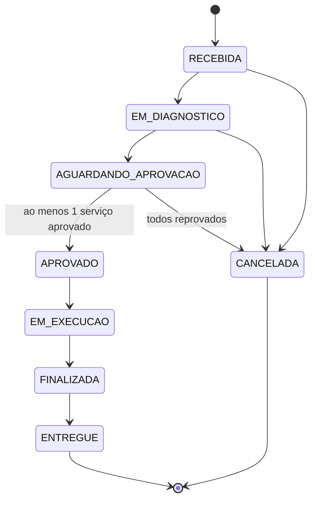
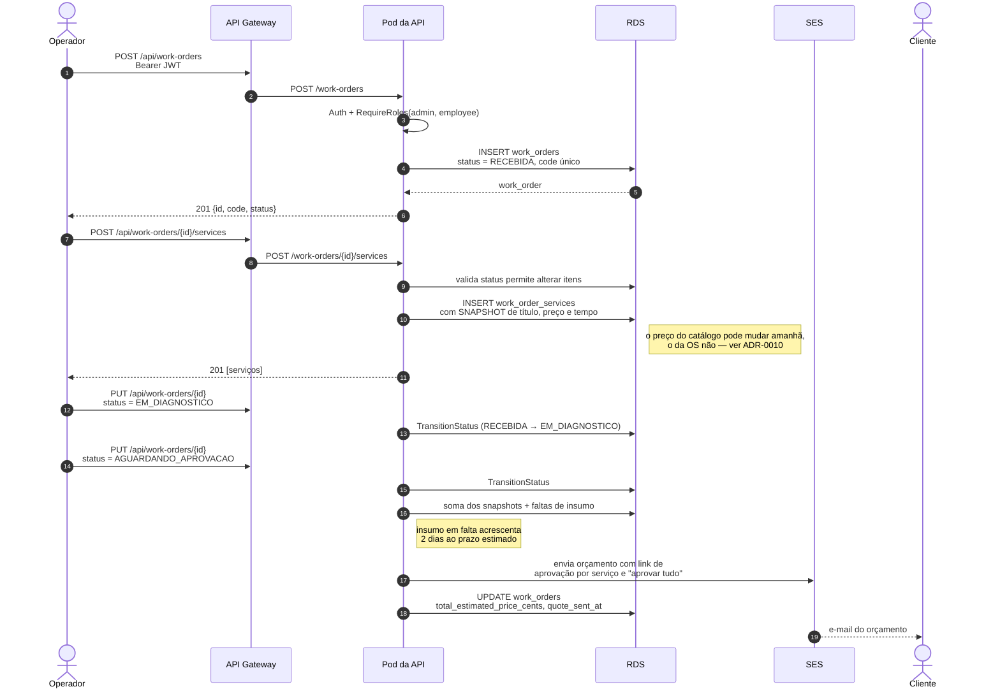
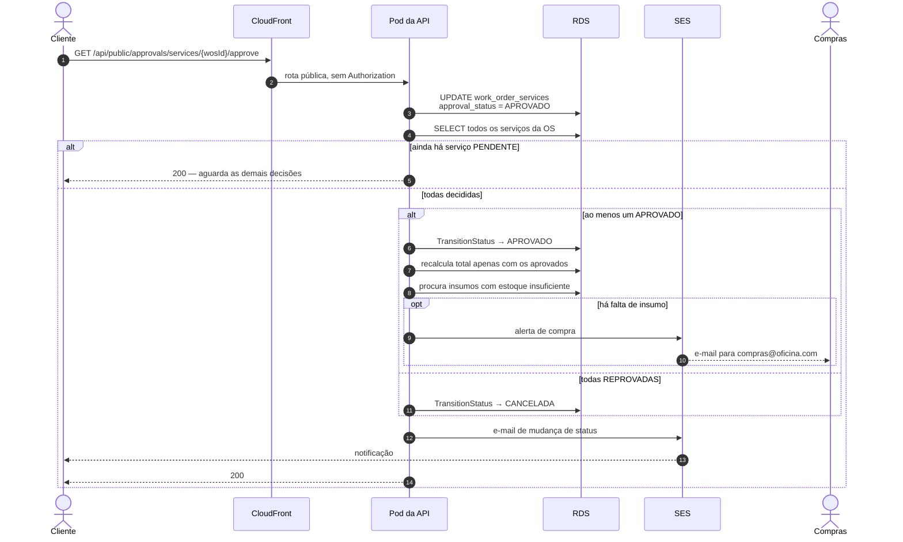
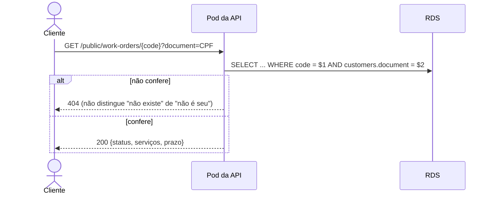
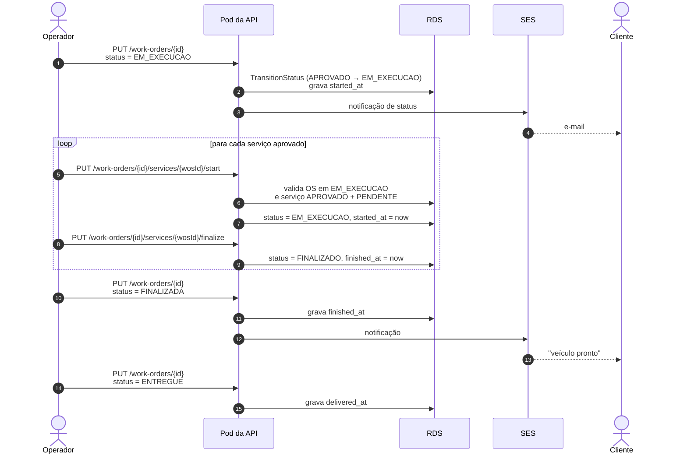

# Diagrama de sequência — ordem de serviço

O ciclo de vida completo: abertura, diagnóstico, orçamento por e-mail, decisão
do cliente e execução. Dois atores humanos com canais distintos — o operador
usa rotas autenticadas por JWT, o cliente usa links públicos recebidos por
e-mail.

## Máquina de estados

A transição é validada no serviço de domínio; qualquer salto fora deste mapa é
rejeitado com `ErrInvalidStatusTransition`.

Itens só podem ser adicionados ou removidos em `RECEBIDA`, `EM_DIAGNOSTICO` ou
`AGUARDANDO_APROVACAO`. Depois de aprovada, a composição da OS está congelada.

## 1. Abertura e envio do orçamento

## 2. Decisão do cliente

O cliente não tem conta nem token. Ele clica no link do e-mail, que carrega o
UUID do item — um identificador não adivinhável.

Em paralelo, o cliente consulta o andamento sem autenticação, provando posse do
documento:

## 3. Execução

## Os carimbos de tempo alimentam as métricas

`received_at`, `quote_sent_at`, `approved_at`, `started_at`, `finished_at` e
`delivered_at` estão em `work_orders`; `started_at` e `finished_at` também em
`work_order_services`. É deles que sai o **tempo médio de execução por status**
exigido no dashboard, sem depender de tabela de histórico. Ver
[RFC-0004](../rfc/0004-estrategia-de-observabilidade.md) e
[banco de dados](../banco-de-dados.md).
