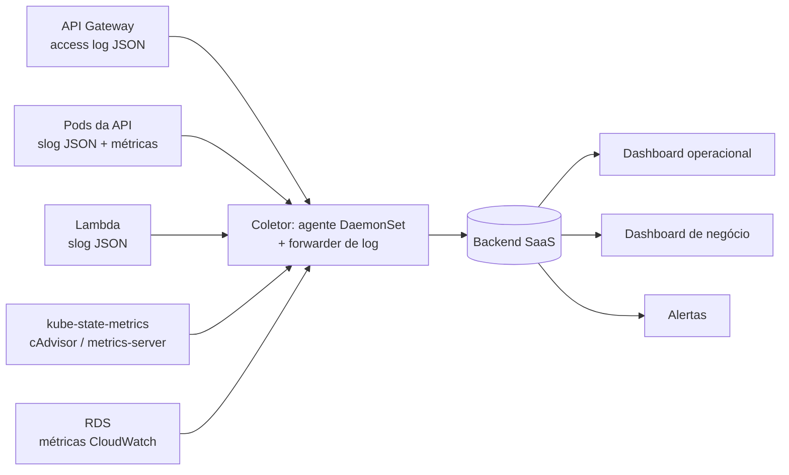

# RFC-0004 — Estratégia de observabilidade

- **Estado:** Aceita
- **Data:** 2026-09-02
- **Decisões derivadas:** [ADR-0011](../adr/0011-logs-estruturados-com-correlacao.md)

## Problema

A fase exige visibilidade sobre latência de API, consumo de CPU e memória do
Kubernetes, healthchecks e uptime, alertas para falha no processamento de ordens
de serviço, logs estruturados com correlação, e três dashboards de negócio.

O ponto de partida é modesto e vale nomear com precisão:

| Existe hoje | Falta |
|---|---|
| Access log JSON do API Gateway no CloudWatch (`requestId`, rota, status) | correlação desse id com a aplicação |
| Log group da Lambda | métrica de latência por rota |
| `metrics-server` no cluster (para o HPA) | retenção e visualização dessas métricas |
| `/ping` e `/ready` com checagem real do banco | monitor externo que os observe |
| `GET /services/avg-execution-time` | dashboards |
| — | logs estruturados ([ADR-0011](../adr/0011-logs-estruturados-com-correlacao.md)) |
| — | qualquer alerta |

Uma complicação específica deste desenho: **o ambiente sobe e desce**. Uma
ferramenta que cobre por host ativo, ou que perde configuração quando o cluster
é recriado, é hostil a esse ciclo. Dashboards e alertas precisam sobreviver ao
`tear-down` — logo, precisam viver **fora** do cluster e ser versionados como
código.

## Os quatro sinais e onde cada um nasce

| Sinal | Fonte | Uso |
|---|---|---|
| **Log** | `slog` JSON da API e da Lambda + access log do gateway | investigação, eventos de domínio, alerta por evento |
| **Métrica de infra** | cAdvisor / kube-state-metrics via agente `DaemonSet` | CPU, memória, réplicas, reinícios, pods não-Ready |
| **Métrica de aplicação** | instrumentação HTTP no Fiber | latência p50/p95/p99 por rota, taxa de erro, throughput |
| **Uptime** | monitor sintético contra a URL pública (`/api/ping`) | disponibilidade vista de fora |

## Alternativas de backend

### Datadog — **recomendado**

**A favor.** Agente `DaemonSet` cobre logs, métricas e APM em uma instalação, com
Helm chart oficial — cabe num `helm_release` da camada efêmera junto com o
`metrics-server`. Autodiscovery de pods significa que um cluster recriado é
descoberto sozinho. **Dashboards e monitores são declaráveis no provider
Terraform `DataDog/datadog`** — versionados na camada *persistente*, sobrevivem
ao `tear-down`, que é exatamente a propriedade que este desenho exige.
Integrações prontas para API Gateway, Lambda e RDS via CloudWatch. Trial de 14
dias sem cartão, suficiente para validar o desenho antes de decidir o gasto.

**Contra.** Cobrança por host e por GB de log ingerido escala rápido depois do
trial. Vocabulário próprio (facets, tags, monitors) com curva de aprendizado.

### New Relic

**A favor.** **Free tier permanente e generoso** — 100 GB/mês de ingestão e um
usuário completo, sem prazo. Para um projeto acadêmico é a proposta comercial
mais confortável das duas. Agente Kubernetes maduro, e NRQL é uma linguagem de
consulta agradável para os dashboards de negócio.

**Contra.** Provider Terraform (`newrelic/newrelic`) menos usado e com menos
exemplos que o do Datadog para dashboards complexos. A experiência de correlação
entre log e trace é boa, mas a configuração inicial do agente em Kubernetes tem
mais passos.

### CloudWatch + Container Insights + Managed Grafana

**A favor.** Nativo, sem SaaS externo, sem chave de API. O access log do gateway
já está lá.

**Contra.** Container Insights custa por métrica personalizada e fica caro
rápido. Correlacionar log de gateway com log de aplicação exige Logs Insights e
consulta manual. Dashboards de negócio dariam bem mais trabalho. E não atende à
letra do requisito, que pede "ferramentas como Datadog ou New Relic".

### Prometheus + Grafana + Loki no cluster

**A favor.** Sem custo de licença, padrão de mercado, controle total.

**Contra.** **Morre com o cluster.** Manter histórico exigiria storage externo e
uma stack a operar. Contraria diretamente o ciclo liga/desliga.

## Recomendação

**Datadog**, pelo motivo que mais pesa neste desenho: dashboards e monitores como
código no Terraform da camada persistente, sobrevivendo ao ciclo de bring-up e
tear-down. **New Relic fica registrado como alternativa direta** — a estratégia
abaixo (o que instrumentar, quais campos, quais painéis, quais alertas) é
independente de fornecedor, e trocar significa reescrever as definições de
dashboard, não a instrumentação.

## Plano

### Fase 1 — Fundação (pré-requisito de tudo)

Logs estruturados JSON com `request_id` propagado da borda, conforme
[ADR-0011](../adr/0011-logs-estruturados-com-correlacao.md). Sem isso, qualquer
backend recebe texto livre e nenhuma correlação é possível. Inclui o *parameter
mapping* no API Gateway que injeta `$context.requestId` como header.

### Fase 2 — Coleta

- `helm_release` do agente na camada efêmera, ao lado do `metrics-server`.
- Chave de API no Secrets Manager, injetada como `Secret` do Kubernetes.
- Encaminhamento dos log groups do API Gateway e da Lambda.
- Métricas do RDS via integração AWS.

### Fase 3 — Instrumentação da aplicação

Middleware de métricas no Fiber: histograma de duração por rota e método,
contador por status. Traço por requisição, carregando `request_id` como tag —
assim log e trace se encontram.

### Fase 4 — Dashboards, como código Terraform

**Operacional**

| Painel | Fonte |
|---|---|
| Latência p50/p95/p99 por rota | métrica de aplicação |
| Taxa de erro (4xx, 5xx) por rota | métrica + access log do gateway |
| CPU e memória por pod, contra `requests`/`limits` | agente |
| Réplicas atuais × desejadas do HPA | kube-state-metrics |
| Pods não-Ready, reinícios, `CrashLoopBackOff` | agente |
| Uptime de `/api/ping` visto de fora | monitor sintético |
| Duração e erro da Lambda; cold starts | integração AWS |
| Conexões, CPU e IOPS do RDS | integração AWS |

**Negócio** — os três exigidos pela fase:

| Painel | Como se calcula |
|---|---|
| **Volume diário de OS** | contagem de `work_order.created` por dia; conferível contra `COUNT(*) ... GROUP BY date(received_at)` |
| **Tempo médio por status** (diagnóstico, execução, finalização) | diferenças entre `received_at`, `quote_sent_at`, `approved_at`, `started_at`, `finished_at`, `delivered_at`; e `finished_at - started_at` por item |
| **Erros e falhas nas integrações** | `budget.send_failed`, erros do SES por *configuration set*, falha de conexão com o RDS, 5xx do gateway |

As colunas de timestamp já existem no schema — foi por isso que a tabela de
histórico de status pôde ser removida sem perder a métrica
([modelo de dados, §4.2](../banco-de-dados.md)).

### Fase 5 — Alertas

| Alerta | Condição | Severidade |
|---|---|---|
| **Falha no processamento de OS** | qualquer `work_order.transition_rejected` ou `ERROR` com `work_order_id` em 5 min | alta |
| Falha de envio de orçamento | ≥ 1 `budget.send_failed` em 15 min | alta |
| API indisponível | `/api/ping` falhando em 2 verificações seguidas | crítica |
| Latência degradada | p95 > 1s por 10 min | média |
| Taxa de 5xx | > 1% das requisições em 5 min | alta |
| HPA no teto | réplicas = 10 por 15 min | média |
| Pod em reinício | ≥ 3 reinícios em 15 min | média |
| Banco perto do limite | conexões > 80% de `max_connections` | alta |
| Espaço em disco do RDS | < 20% livre | média |

O primeiro é o exigido explicitamente pela fase, e é a razão de os eventos de
domínio serem nomeados na [ADR-0011](../adr/0011-logs-estruturados-com-correlacao.md):
alerta sobre evento estruturado é estável; alerta sobre texto de mensagem quebra
na primeira refatoração.

## Riscos

| Risco | Mitigação |
|---|---|
| Custo de ingestão de log | amostrar `INFO` em produção; `ERROR` e `WARN` sempre íntegros |
| Chave de API vazada | Secrets Manager, nunca em variável de repositório |
| Dado pessoal em log | taxonomia proíbe `document`, senha e token; `LogValue()` nos tipos de domínio |
| Alerta ruidoso vira alerta ignorado | começar só pelos de severidade alta e crítica; ajustar limiares com dado real |
| Dashboard perdido no tear-down | definido em Terraform na camada **persistente** |
| Fim do trial durante a avaliação | New Relic documentado como alternativa; a instrumentação não muda |
