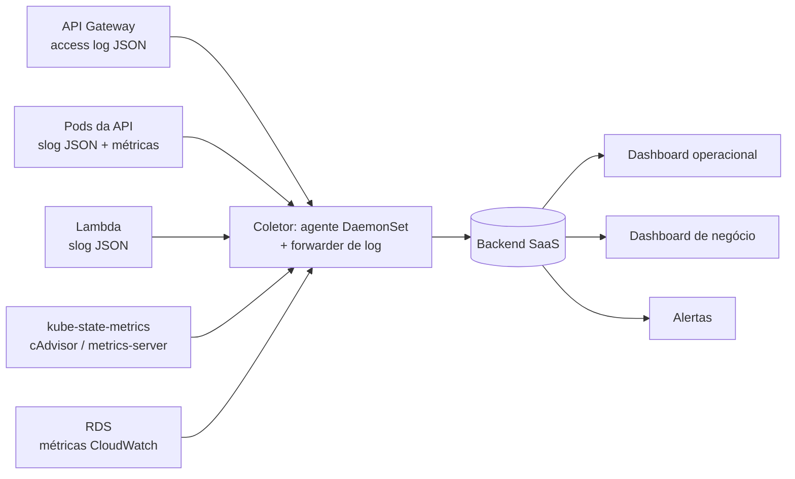

# RFC-0004. Estratégia de observabilidade

**Aceita** · 2026-09-02 · Origina [ADR-0011](../adr/0011-logs-estruturados-com-correlacao.md)

**Problema.** O desafio exige visibilidade sobre latência de API, consumo de
CPU e memória do Kubernetes, healthchecks e uptime, alertas para falha no
processamento de ordens de serviço, logs estruturados com correlação, e três
dashboards de negócio.

| Existe hoje | Falta |
|---|---|
| Access log JSON do API Gateway no CloudWatch, com `requestId`, rota e status | correlação desse id com a aplicação |
| Log group da Lambda | métrica de latência por rota |
| `metrics-server` no cluster, usado pelo HPA | retenção e visualização dessas métricas |
| `/ping` e `/ready` com checagem real do banco | monitor externo que os observe |
| `GET /services/avg-execution-time` | dashboards, logs estruturados e qualquer alerta |

Uma complicação específica deste desenho: **o ambiente sobe e desce**. Uma
ferramenta que cobra por host ativo, ou que perde configuração quando o cluster
é recriado, é hostil a esse ciclo. Dashboards e alertas precisam sobreviver ao
`tear-down`, logo precisam viver fora do cluster e ser versionados como código.

## Os quatro sinais

| Sinal | Fonte | Uso |
|---|---|---|
| Log | `slog` JSON da API e da Lambda, mais o access log do gateway | investigação, eventos de domínio, alerta por evento |
| Métrica de infra | cAdvisor e kube-state-metrics, via agente `DaemonSet` | CPU, memória, réplicas, reinícios, pods não-Ready |
| Métrica de aplicação | instrumentação HTTP no Fiber | latência p50/p95/p99 por rota, taxa de erro, throughput |
| Uptime | monitor sintético contra `/api/ping` | disponibilidade vista de fora |

## Alternativas de backend

| Opção | A favor | Contra |
|---|---|---|
| **Datadog** (recomendado) | agente `DaemonSet` cobre logs, métricas e APM em uma instalação, com Helm chart que cabe em um `helm_release` da camada efêmera; autodiscovery encontra um cluster recriado sozinho; **dashboards e monitores declaráveis no provider `DataDog/datadog`**, versionados na camada persistente e sobreviventes ao `tear-down`; integrações prontas para API Gateway, Lambda e RDS; trial de 14 dias sem cartão | cobrança por host e por GB de log escala rápido depois do trial; vocabulário próprio com curva de aprendizado |
| New Relic | free tier permanente de 100 GB/mês e um usuário completo; agente Kubernetes maduro; NRQL confortável para dashboards de negócio | provider Terraform menos usado, com menos exemplos para dashboards complexos; configuração inicial do agente tem mais passos |
| CloudWatch, Container Insights e Managed Grafana | nativo, sem SaaS externo nem chave de API; o access log já está lá | Container Insights cobra por métrica personalizada e fica caro rápido; correlacionar gateway com aplicação exige Logs Insights manual; não atende à letra do requisito |
| Prometheus, Grafana e Loki no cluster | sem custo de licença, controle total | **morre com o cluster**: manter histórico exigiria storage externo e uma stack a operar, o que contraria o ciclo de liga e desliga |

**Recomendação.** Datadog, pelo motivo de maior peso: dashboards e monitores
como código na camada persistente, sobrevivendo ao ciclo de bring-up e
tear-down. **New Relic fica registrado como alternativa direta**: a estratégia
abaixo é independente de fornecedor, e trocar significa reescrever as
definições de dashboard, não a instrumentação.

## Plano, em cinco fases

Estado em 2026-09-10: as cinco fases estão escritas. As que moram neste
repositório estão na branch de trabalho; as das aplicações estão em Pull
Request nos repositórios delas.

| Fase | Onde | Estado |
|---|---|---|
| 1. logs JSON com `request_id` | *parameter mapping* aqui; `slog` em [monolith#4][pr-mono] e [serverless#4][pr-lambda] | feito, em revisão |
| 2. coleta: agente, forwarder, integração AWS | `ephemeral/datadog.tf`, `persistent/datadog.tf` | feito |
| 3. instrumentação HTTP e APM | [monolith#4][pr-mono] | feito, em revisão |
| 4. dashboards como código | `persistent/datadog_dashboard_*.tf` | feito |
| 5. alertas | `persistent/datadog_monitors.tf` | feito |

[pr-mono]: https://github.com/SOAT-15-Oficina/oficina-mecanica-monolith/pull/4
[pr-lambda]: https://github.com/SOAT-15-Oficina/oficina-mecanica-serverless/pull/4

A ordem importa: painéis e alertas **existem e ficam em zero** até a fase 1
chegar em produção com os campos que eles consultam. Esse é o estado esperado,
de infraestrutura pronta esperando o dado.

**Fase 1.** Logs estruturados com `request_id` propagado da borda, conforme
[ADR-0011](../adr/0011-logs-estruturados-com-correlacao.md). A parte que mora neste repositório é o *parameter
mapping* do API Gateway (`ephemeral/apigateway_routes.tf`), só na integração
HTTP_PROXY, porque `AWS_PROXY` não aceita parameter mapping e a Lambda lê o
mesmo valor em `RequestContext.RequestID`. `DD_ENV` e `DD_SERVICE` ficam fora
do condicional `datadog_enabled`: log com `env` e `service` é útil com ou sem
Datadog, e um campo intermitente é menos útil que um campo ausente.

**Fase 2.** `helm_release` do agente na camada efêmera, chave de API no Secrets
Manager injetada como `Secret`, encaminhamento dos log groups do gateway e da
Lambda, e métricas do RDS via integração AWS. Dois pontos surgiram na
implementação: a integração AWS pertence à conta e não ao ambiente, então só
produção a possui (`manage_datadog_aws_integration`) e homologação continua
enxergando tudo pela tag `env`, que por isso entrou no `default_tags` das duas
camadas; e `logs_config.sources` ficou vazio de propósito, porque preenchido o
Datadog assinaria por conta própria log groups de outro projeto na mesma conta.
As assinaturas são `aws_cloudwatch_log_subscription_filter` explícitos.

**Fase 3.** Middleware no Fiber com linha de acesso por rota e status, de onde
sai `oficina.http_request_duration`, e traço por requisição com `request_id`
como tag. Não existe contrib oficial do `dd-trace-go` para o Fiber v3, só para
o v2: o span sai do próprio middleware, o que custa cerca de 40 linhas e evita
segurar a versão do Fiber.

**Fase 4, dashboard operacional.** Latência p50/p95/p99 por rota e taxa de erro
(métrica de aplicação e access log); CPU e memória por pod contra `requests` e
`limits`, réplicas do HPA, pods não-Ready e reinícios (agente e
kube-state-metrics); uptime de `/api/ping` (monitor sintético); duração, erro e
cold start da Lambda, e conexões, CPU e IOPS do RDS (integração AWS).

**Fase 4, dashboards de negócio.** Os três exigidos, todos derivados de
métricas de log (`persistent/datadog_metrics.tf`) e não de consulta a log: o
contador é calculado na ingestão e guardado como métrica, o que resolve de uma
vez o custo de ingestão e a janela curta de retenção.

| Painel | Como se calcula |
|---|---|
| Volume diário de OS | contagem de `work_order.created` por dia, conferível contra `COUNT(*) ... GROUP BY date(received_at)` |
| Tempo médio por status | diferenças entre `received_at`, `quote_sent_at`, `approved_at`, `started_at`, `finished_at` e `delivered_at`; e `finished_at - started_at` por item |
| Erros nas integrações | `budget.send_failed`, erros do SES por *configuration set*, falha de conexão com o RDS, 5xx do gateway |

**Fase 5, alertas.**

| Alerta | Condição | Severidade |
|---|---|---|
| Falha no processamento de OS | `work_order.transition_rejected` ou `ERROR` com `work_order_id` em 5 min | alta |
| Falha de envio de orçamento | 1 ou mais `budget.send_failed` em 15 min | alta |
| API indisponível | `/api/ping` falhando em 2 verificações seguidas | crítica |
| Latência degradada | p95 acima de 1s por 10 min | média |
| Taxa de 5xx | acima de 1% das requisições em 5 min | alta |
| HPA no teto | réplicas em 10 por 15 min | média |
| Pod em reinício | 3 ou mais reinícios em 15 min | média |
| Banco perto do limite | conexões acima de 80% de `max_connections` | alta |
| Disco do RDS | menos de 20% livre | média |

O primeiro é o exigido explicitamente, e é a razão de os eventos de domínio
serem nomeados na [ADR-0011](../adr/0011-logs-estruturados-com-correlacao.md): alerta sobre evento estruturado é
estável, alerta sobre texto de mensagem quebra na primeira refatoração.

## Riscos

| Risco | Mitigação |
|---|---|
| Custo de ingestão de log | amostrar `INFO` em produção; `ERROR` e `WARN` sempre íntegros |
| Chave de API vazada | Secrets Manager, nunca em variável de repositório |
| Dado pessoal em log | a taxonomia proíbe `document`, senha e token; `LogValue()` nos tipos de domínio |
| Alerta ruidoso vira alerta ignorado | começar por severidade alta e crítica, e ajustar limiares com dado real |
| Dashboard perdido no tear-down | definido em Terraform na camada persistente |
| Fim do trial durante a avaliação | New Relic como alternativa; a instrumentação não muda |
